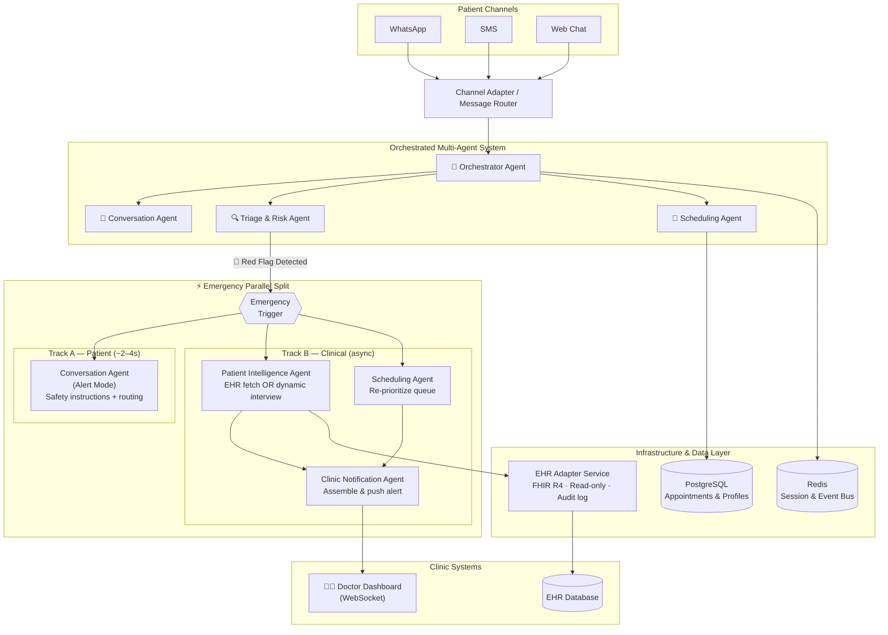

# 🏥 Clinical Flow
### Intelligent Patient Assistant System for Modern Healthcare Clinics

> An AI-powered conversational platform that automates patient onboarding, appointment booking, and real-time clinical triaging across WhatsApp, SMS, and Web Chat — built on an Orchestrated Multi-Agent architecture.

---

## The Problem

Modern clinics are losing time and risking patient safety at three critical friction points:

- **Administrative overload** — Receptionists spend the majority of their day handling appointment calls, checking availability, and managing waitlists manually, leaving little capacity for higher-value tasks.
- **Delayed triage** — There is no real-time mechanism to detect high-risk patients in a queue. A patient describing chest pain sits in the same line as someone booking a routine checkup.
- **Blind handoffs** — When an urgent patient does arrive, the doctor has no pre-briefing. If the patient is new, zero clinical context exists. If they are existing, someone must scramble to pull their record manually.

---

## Solution Overview

Clinical Flow replaces the traditional front-desk bottleneck with an **Orchestrated Multi-Agent AI System**. A central Orchestrator routes every patient interaction to five specialized agents — each with a defined clinical or operational role — that operate concurrently rather than sequentially. When a patient describes a life-threatening symptom, the system immediately splits into two parallel execution tracks: one sends the patient real-time safety instructions, the other silently fetches their medical history, re-prioritizes the clinic queue, and pushes a formatted alert to the doctor's dashboard — all before the patient walks through the door.

---

## Agent Roster

| Agent | Core Role | Primary Tools & Capabilities |
|---|---|---|
| **Orchestrator Agent** | Central brain — routes requests, manages agent lifecycle, triggers emergency split | LLM function-calling router, conditional edge logic (LangGraph), session state manager |
| **Conversation Agent** | Sole patient-facing interface across all channels | NLP / multi-turn dialogue, channel abstraction (WhatsApp / SMS / Web), tone-shift on emergency, multilingual support |
| **Triage & Risk Agent** | Evaluates every patient message for clinical red flags in real time | Symptom extraction (LLM), deterministic red-flag rules engine (NICE/WHO criteria), risk scoring (Green / Amber / Red) |
| **Scheduling Agent** | Owns all appointment and queue operations | Clinic calendar API read/write, real-time availability lookup, wait-time calculation, emergency queue re-prioritization |
| **Patient Intelligence Agent** | Retrieves or builds patient clinical context on emergency trigger | EHR record fetch (via FHIR adapter), dynamic intake interview (new patients), structured clinical brief generation |
| **Clinic Notification Agent** | Assembles and delivers the real-time alert to the care team | Clinical brief formatter, WebSocket push to doctor dashboard, alert deduplication |

---

## Parallel Emergency Workflow

When the Triage & Risk Agent returns a **🔴 Red Flag**, the Orchestrator does not wait — it fires two independent execution tracks simultaneously.

### Track A — Patient (Target: ~2–4 seconds)
The Conversation Agent immediately shifts into alert mode and delivers:
- Acknowledgment of the reported symptoms with appropriate urgency
- Clear safety instructions (e.g., sit down, do not drive, call emergency services if symptoms worsen)
- Routing guidance to the clinic or nearest emergency department

The patient receives this response within seconds, regardless of how long Track B takes.

### Track B — Clinical Data (Target: complete before patient arrives)

Two agents execute in parallel:

**Patient Intelligence Agent** determines whether the patient is known or new:

- **Existing patient** → Fetches full EHR record: allergies, current medications, chronic conditions, last visit notes.
- **New patient** → Conducts a focused dynamic interview, limited to four critical questions:
  1. Do you have any known allergies, particularly to medications?
  2. Do you have any chronic conditions (e.g., diabetes, heart disease, hypertension)?
  3. Are you currently taking any medications, including supplements?
  4. Have you experienced these symptoms before, and if so, when?

**Scheduling Agent** simultaneously re-orders the clinic queue, placing the flagged patient at the front.

Once both complete, the **Clinic Notification Agent** assembles a structured clinical brief and pushes it to the doctor's dashboard via WebSocket — formatted, actionable, and waiting before the patient arrives.

> **Core design principle:** Track A never waits for Track B. Patient safety instructions are never delayed by data retrieval.

---

## Security & Compliance Layer

- **EHR Adapter Service** sits between all agents and the clinic database. It is a deterministic microservice — not an AI agent — enforcing field-level access controls, FHIR R4 compliance, full audit logging, and rate limiting.
- **AI agents have read-only EHR access**, with one narrow exception: the Scheduling Agent may re-order the appointment queue. No agent may write clinical notes or update patient records without a human confirmation on the doctor's dashboard.
- All conversation sessions are scoped and isolated by session ID. No patient context bleeds across sessions.

---

## System Architecture

---

## Project Status

> 🚧 This repository documents the approved architecture for Clinical Flow. Implementation is in active planning. Contributions and feedback from clinical and engineering stakeholders are welcome via Issues.

---

*Built with safety, auditability, and clinical utility as first-class constraints.*
